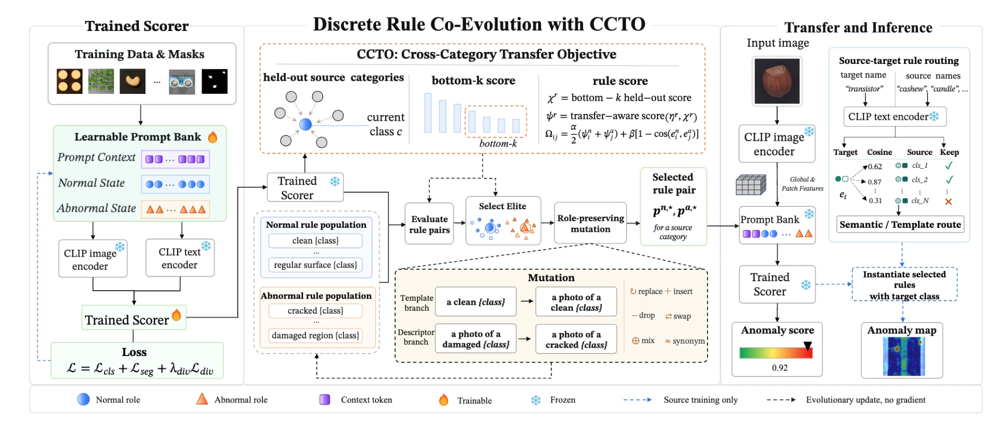
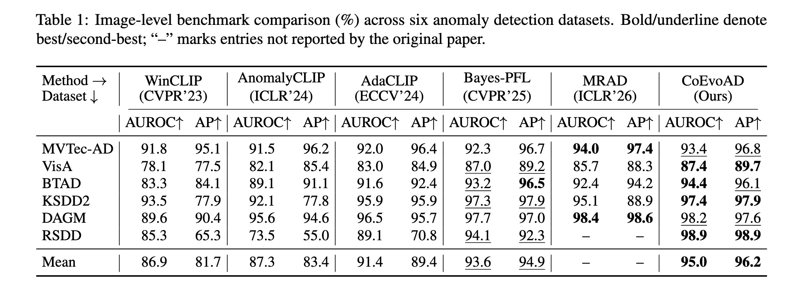
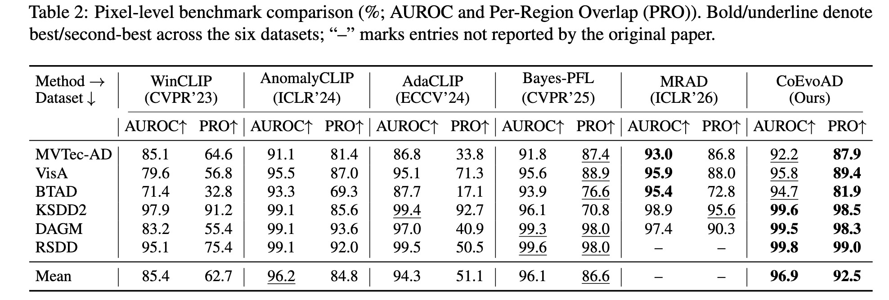
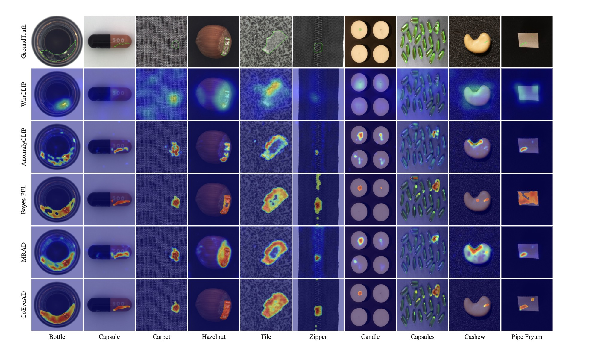

# CoEvoAD

> [**EMNLP 2026**] **Co-Evolutionary Prompt Optimization with Cross-Category Transfer for Zero-Shot Anomaly Detection**
>
> Official implementation. A paper link will be added once the ACL Anthology version is online.

  



## Updates

- **2026-08**: Code released.
- **2026-08**: The paper is accepted to **EMNLP 2026** (main conference).

## Introduction

Zero-shot anomaly detection (ZSAD) has gained significant attention for its practical value in industrial inspection. Recently, CLIP-based approaches have been widely adopted in ZSAD due to their strong vision-language generalization capabilities. However, existing methods commonly employ continuous prompt embeddings for prompt optimization and encode semantics in latent vectors, which lack interpretability and scalability. To this end, we propose CoEvoAD, a co-evolutionary framework for discrete prompt selection. CoEvoAD performs prompt search in the discrete natural-language space using an evolutionary algorithm. Candidate prompts are iteratively generated, evaluated, and selected throughout population evolution, thus preserving the interpretability and composability of natural language. Furthermore, we introduce a Cross-Category Transfer Objective (CCTO), which treats held-out source categories as proxies for unseen categories and scores prompt rules based on their estimated cross-category transferability, effectively improving cross-category generalization. Extensive experiments are conducted to validate the effectiveness of CoEvoAD, and the results show that it achieves state-of-the-art performance across multiple anomaly detection datasets.

A note on the protocol this repository enforces: candidate rules are selected by CCTO using held-out performance across *source* categories only. No target-domain image, label, or metric is used at any point before final evaluation.

## Setup

Create a new conda environment and install the required packages:

```bash
conda create -n coevoad python=3.9
conda activate coevoad

# Install PyTorch matching your CUDA version first: https://pytorch.org/get-started/locally/
pip install torch torchvision

pip install -r requirements.txt
```

Note: `imgaug` requires `numpy < 2.0`, which is why numpy is pinned to `1.26.3`.

Experiments in the paper are conducted on a single NVIDIA RTX 4090.

Then download the CLIP ViT-L/14@336px backbone (about 900 MB) to the default path the scripts expect:

```bash
mkdir -p pretrained_weight
wget -O pretrained_weight/ViT-L-14-336px.pt \
  https://openaipublic.azureedge.net/clip/models/3035c92b350959924f9f00213499208652fc7ea050643e8b385c2dac08641f02/ViT-L-14-336px.pt
```

If you keep the weight somewhere else, pass `--pretrained_path` to every command below. The matching model config (`open_clip_local/model_configs/ViT-L-14-336.json`) already ships with this repo.

## Dataset Preparation

**1. Download the original datasets to any desired path:**

- **MVTec-AD**: https://www.mvtec.com/company/research/datasets/mvtec-ad
- **VisA**: [VisA_20220922.tar](https://amazon-visual-anomaly.s3.us-west-2.amazonaws.com/VisA_20220922.tar) (from [amazon-science/spot-diff](https://github.com/amazon-science/spot-diff))

The converter expects the official release layouts:

```
path1                                path2
├── mvtec                            ├── visa
    ├── bottle                           ├── candle
        ├── train                            ├── Data
            ├── good                             ├── Images
        ├── test                                     ├── Anomaly
            ├── good                                 ├── Normal
            ├── anomaly1                         ├── Masks
        ├── ground_truth                             ├── Anomaly
            ├── anomaly1                     ├── split_csv
                                                 ├── 1cls.csv
```

**2. Standardize the datasets and generate the meta files.**

`dataset/make_dataset.py` converts the official releases into the normalized layout the code reads. Edit the `src` entries in `datasets_config` at the bottom of that file to point at your downloaded archives, then run it *from the `dataset/` directory* — its `des` paths are relative to it:

```bash
cd dataset && python make_dataset.py && cd ..
```

The same `datasets_config` also carries converter entries for the external targets used in the paper (BTAD, KSDD2, DAGM, RSDD) and more; enable the entries you need. The resulting normalized layout:

```
dataset/mvisa/data/
├── meta_visa.json
├── meta_mvtec.json
├── visa/
│   └── <category>/
│       ├── train/good/
│       ├── test/good/
│       ├── test/<defect>/
│       └── ground_truth/<defect>/
└── mvtec/
    └── <category>/
        ├── train/good/
        ├── test/good/
        ├── test/<defect>/
        └── ground_truth/<defect>/
```

`dataset/make_meta.py` relies on two naming constraints in this layout: every anomalous image has a mask under `ground_truth/<defect>/` with the **same basename**, and masks are `.png` (an image `x.bmp` pairs with a mask `x.png`).

**Generating the meta files.** Edit `dataset_list` at the bottom of `dataset/make_meta.py`, which defaults to `["DTD"]`:

```python
dataset_list = ["visa", "mvtec"]
```

Then run it from the repository root:

```bash
python dataset/make_meta.py
```

## Train

Two steps, both run on the **source** domain only. The paper's frozen configuration is baked into [train.sh](train.sh), which runs them end-to-end:

```bash
bash train.sh visa 0    # arguments: source dataset (visa | mvtec), GPU id
```

**Step 1 — prompt-bank training** (`train_two_stage.py`) writes a checkpoint into `./my_exps/train_visa/`, named either `stage1_final.pth` or `two_stage_final.pth` depending on which internal phase the training loop ended in; the script resolves the name automatically.

**Step 2 — co-evolutionary rule search** (`optimize_universal.py`) loads that frozen checkpoint, searches discrete prompt rules under CCTO, and writes them to `./my_exps/coevo_visa/evo_prompt_cache.json`.

Key settings already baked into the script:

- `--source_only_validation`: validate on held-out source categories — see the warning below.
- `--evo_population`, `--evo_generations`, `--evo_topk`: population size N, search generations G, and elites carried per generation.
- `--use_coevo_prompt`, `--coevo_pair_k`: role-separated co-evolution over normal/abnormal rule populations, with K sampled partners when scoring rule pairs.
- `--ccto`, `--ccto_alpha`: the Cross-Category Transfer Objective (held-out source categories as proxies for unseen categories), with own-category weight α (cross-category weight 1 − α).
- `--ccto_cross_agg bottomk`, `--ccto_bottomk`: aggregate cross-category scores by averaging the k lowest-scoring held-out categories.

To deviate from the paper configuration, edit the full `python` commands inside `train.sh`.

> **Source-only validation is the default.** Best-checkpoint selection and early stopping only ever see held-out source categories. The legacy upstream behavior — validating on the *opposite* dataset — is still available via `--legacy_cross_domain_validation`, but it lets target-domain metrics drive checkpoint selection, which breaks the zero-shot protocol this work is about; do not use it for reproduction.

## Test

Evaluate zero-shot transfer to the unseen target domain. Rules and checkpoints come from the source domain; target labels are used only to compute the final metrics.

```bash
bash test.sh visa 0     # VisA -> MVTec-AD; use `bash test.sh mvtec` for the reverse direction
```

The script resolves the Step-1 checkpoint automatically and calls `test_universal.py`, one of two evaluation entrypoints:

- `test_universal.py` — enables the transfer routing used in the paper (semantic fallback + template transfer). **Use this to reproduce the main results.**
- `test_strict.py` — strict evaluation with transfer routing disabled, used for the control rows.

Key settings already baked into the script:

- `--evo_rules_path`: the rule cache written by the train step.
- `--enable_semantic_fallback`, `--semantic_fallback_min_sim`, `--semantic_fallback_min_margin`: frozen source-only semantic routing for unseen category names, with its cosine-similarity and margin thresholds.
- `--enable_template_transfer`: template-transfer routing for categories without a semantic match.
- `--pixel_sigma`: Gaussian sigma for smoothing pixel-level anomaly maps.

Any further arguments after the first two are forwarded to `test_universal.py` (e.g. `bash test.sh visa 0 --save_visualizations`).

Two environment variables affect evaluation. `COEVOAD_TEST_ROUTE_PROFILE` selects the route profile and is set automatically by each entrypoint (`STRICT_MAINLINE` in `test_strict.py`, `SUPPLEMENTARY_FALLBACK` in `test_universal.py`), so you normally never set it by hand. `COEVO_DUMP_PER_IMAGE_SCORES=1` additionally saves per-image anomaly scores and labels to `per_image_scores_<dataset>.npz` under `--save_path`, for score-distribution figures.

## Main Results

CoEvoAD is evaluated under strict cross-dataset transfer: the scorer is trained on a source dataset and evaluated on target datasets without target-domain images, labels, or supervision. The two primary transfer directions are VisA → MVTec-AD and MVTec-AD → VisA; BTAD, KSDD2, DAGM, and RSDD serve as external industrial targets under the same source-only protocol. Baseline numbers are taken from the original papers or their official codebases where available.





## Visualization

Anomaly maps on MVTec-AD and VisA categories, compared with ground truth and baseline methods:



To dump such maps from your own runs, add `--save_visualizations` to either test command — input, anomaly map, and overlay are written under `<save_path>/imgs` (`--visualization_limit_per_class N` caps the number per category).

## Download Weights

Pretrained checkpoints and searched rule caches will be released here shortly.

Until then, everything can be reproduced from scratch with the commands above. Once released, place the files anywhere and pass their paths via `--checkpoint_path` and `--evo_rules_path`.

## Acknowledgements

This repository builds on the following MIT-licensed projects. Please comply with their original licenses.

- **[Bayes-PFL](https://github.com/xiaozhen228/Bayes-PFL)** (CVPR 2025) — this codebase is derived from it; the two-stage training pipeline, dataset layout, and CLIP wrappers originate there.
- **[AnomalyCLIP](https://github.com/zqhang/AnomalyCLIP)** — components under `models/external/anomalyclip/`.
- **[OpenAI CLIP](https://github.com/openai/CLIP)** and **[open_clip](https://github.com/mlfoundations/open_clip)** — tokenizer and model configs.

## Citation

Questions and issues are welcome via GitHub Issues, or contact 24281153@bjtu.edu.cn.

If you find this work useful, please cite:

```bibtex
@inproceedings{coevoad2026,
  title     = {Co-Evolutionary Prompt Optimization with Cross-Category Transfer
               for Zero-Shot Anomaly Detection},
  author    = {TODO: camera-ready author list},
  booktitle = {Proceedings of the 2026 Conference on Empirical Methods in
               Natural Language Processing},
  year      = {2026},
}
```

The entry above is a placeholder; it will be replaced once the paper appears in
the ACL Anthology.

## License

The code in this repository is licensed under the [MIT license](LICENSE).
