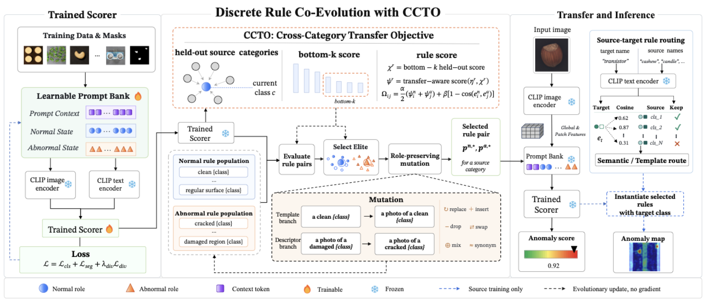
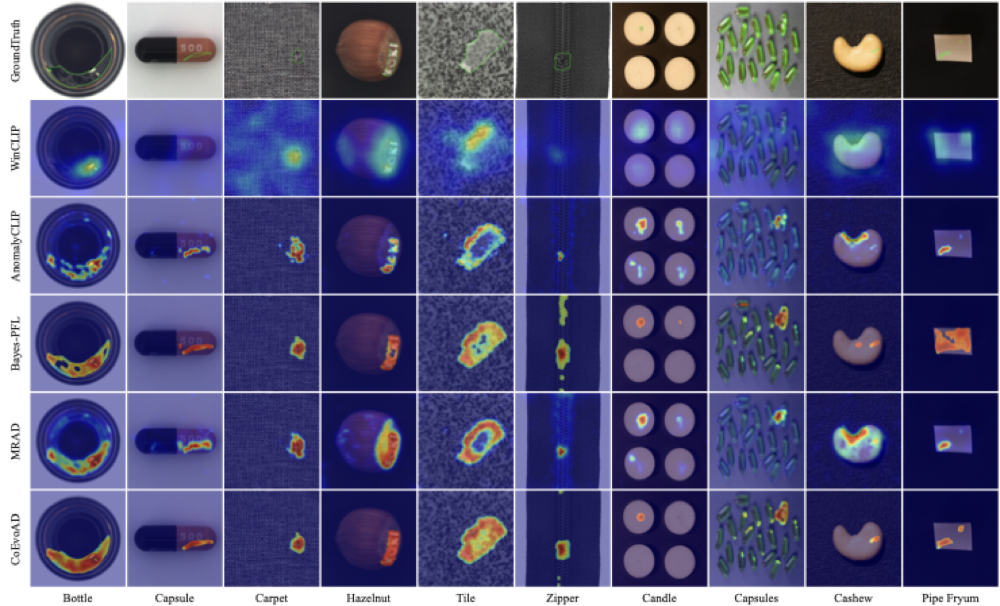

# CoEvoAD

> [**EMNLP 2026**] **Co-Evolutionary Prompt Optimization with Cross-Category Transfer for Zero-Shot Anomaly Detection**
>
> Official implementation. A paper link will be added once the ACL Anthology version is online.



## Table of Contents

* [📢 Updates](#updates)
* [📖 Introduction](#introduction)
* [🔧 Setup](#setup)
* [📊 Dataset Preparation](#dataset-preparation)
* [🚀 Train](#train)
* [🧪 Test](#test)
* [📈 Main Results](#main-results)
* [🎨 Visualization](#visualization)
* [⬇️ Download Weights](#download-weights)
* [🙏 Third-Party Code](#third-party-code)
* [🔗 Citation](#citation)
* [📜 License](#license)

## Updates

- **2026-08**: Code released.
- **2026-08**: The paper is accepted to **EMNLP 2026** (main conference).

## Introduction

Zero-shot anomaly detection (ZSAD) has gained significant attention for its practical value in industrial inspection. Recently, CLIP-based approaches have been widely adopted in ZSAD due to their strong vision-language generalization capabilities. However, existing methods commonly employ continuous prompt embeddings for prompt optimization and encode semantics in latent vectors, which lack interpretability and scalability. To this end, we propose CoEvoAD, a co-evolutionary framework for discrete prompt selection. CoEvoAD performs prompt search in the discrete natural-language space using an evolutionary algorithm. Candidate prompts are iteratively generated, evaluated, and selected throughout population evolution, thus preserving the interpretability and composability of natural language. Furthermore, we introduce a Cross-Category Transfer Objective (CCTO), which treats held-out source categories as proxies for unseen categories and scores prompt rules based on their estimated cross-category transferability, effectively improving cross-category generalization. Extensive experiments are conducted to validate the effectiveness of CoEvoAD, and the results show that it achieves state-of-the-art performance across multiple anomaly detection datasets.

A note on the protocol this repository enforces: candidate rules are selected by CCTO using held-out performance across *source* categories only. No target-domain image, label, or metric is used at any point before final evaluation.

## Setup

Create a new conda environment and install the required packages:

```bash
conda create -n coevoad python=3.9
conda activate coevoad

# Install PyTorch matching your CUDA version first: https://pytorch.org/get-started/locally/
pip install torch torchvision

pip install -r requirements.txt
```

Note: `imgaug` requires `numpy < 2.0`, which is why numpy is pinned to `1.26.3`.

Experiments in the paper are conducted on a single NVIDIA RTX 4090.

Then download the CLIP ViT-L/14@336px backbone (about 900 MB) to the default path the scripts expect:

```bash
mkdir -p pretrained_weight
wget -O pretrained_weight/ViT-L-14-336px.pt \
  https://openaipublic.azureedge.net/clip/models/3035c92b350959924f9f00213499208652fc7ea050643e8b385c2dac08641f02/ViT-L-14-336px.pt
```

If you keep the weight somewhere else, pass `--pretrained_path` to every command below. The matching model config (`open_clip_local/model_configs/ViT-L-14-336.json`) already ships with this repo.

## Dataset Preparation

**1. Download the original datasets to any desired path:**

- **MVTec-AD**: https://www.mvtec.com/company/research/datasets/mvtec-ad
- **VisA**: [VisA_20220922.tar](https://amazon-visual-anomaly.s3.us-west-2.amazonaws.com/VisA_20220922.tar) (from [amazon-science/spot-diff](https://github.com/amazon-science/spot-diff))

The converter expects the official release layouts:

```
path1                                path2
├── mvtec                            ├── visa
    ├── bottle                           ├── candle
        ├── train                            ├── Data
            ├── good                             ├── Images
        ├── test                                     ├── Anomaly
            ├── good                                 ├── Normal
            ├── anomaly1                         ├── Masks
        ├── ground_truth                             ├── Anomaly
            ├── anomaly1                     ├── split_csv
                                                 ├── 1cls.csv
```

**2. Standardize the datasets and generate the meta files.**

`dataset/make_dataset.py` converts the official releases into the normalized layout the code reads. Edit the `src` entries in `datasets_config` at the bottom of that file to point at your downloaded archives, then run it *from the `dataset/` directory* — its `des` paths are relative to it:

```bash
cd dataset && python make_dataset.py && cd ..
```

The same `datasets_config` also carries converter entries for the external targets used in the paper (BTAD, KSDD2, DAGM, RSDD) and more; enable the entries you need. The resulting normalized layout:

```
dataset/mvisa/data/
├── meta_visa.json
├── meta_mvtec.json
├── visa/
│   └── <category>/
│       ├── train/good/
│       ├── test/good/
│       ├── test/<defect>/
│       └── ground_truth/<defect>/
└── mvtec/
    └── <category>/
        ├── train/good/
        ├── test/good/
        ├── test/<defect>/
        └── ground_truth/<defect>/
```

`dataset/make_meta.py` relies on two naming constraints in this layout: every anomalous image has a mask under `ground_truth/<defect>/` with the **same basename**, and masks are `.png` (an image `x.bmp` pairs with a mask `x.png`).

**Generating the meta files.** Edit `dataset_list` at the bottom of `dataset/make_meta.py`, which defaults to `["DTD"]`:

```python
dataset_list = ["visa", "mvtec"]
```

Then run it from the repository root:

```bash
python dataset/make_meta.py
```

## Train

Two steps, both run on the **source** domain only. `bash train.sh visa` (or `bash train.sh mvtec`) runs both steps end-to-end with the settings below; the individual commands are:

**Step 1 — prompt-bank training:**

```bash
python train_two_stage.py \
  --dataset visa \
  --train_data_path ./dataset/mvisa/data \
  --val_data_path ./dataset/mvisa/data \
  --save_path ./my_exps/train_visa \
  --prompt_num 3 --batch_size 32 --epochs 30 --eval_every 1 \
  --image_size 518 --num_workers 4 \
  --source_only_validation --stage1_only \
  --seed 111 --device_id 0
```

Key parameters:

- `--dataset`: the source training dataset (`visa` or `mvtec`); the opposite dataset is the unseen target at test time.
- `--source_only_validation`: validate on held-out source categories instead of the legacy cross-domain validation set. **Required — see the warning below.**
- `--stage1_only`: stop after prompt-bank training; the rule search runs separately in Step 2.
- `--eval_every`: run full validation every N epochs.

> **`--source_only_validation` is required.** It is off by default, and without it validation runs on the *opposite* dataset — training on VisA validates on MVTec. Those target-domain metrics then drive best-checkpoint selection and early stopping, which breaks the zero-shot protocol this work is about.

This writes a checkpoint into `./my_exps/train_visa/`. The filename is **either `stage1_final.pth` or `two_stage_final.pth`**: the training loop may internally switch from pixel-level to classification-head fine-tuning when pixel AP stalls, and the name reflects which phase it ended in. Both are valid inputs to the next step, so resolve it rather than hardcoding:

```bash
CKPT=$(ls ./my_exps/train_visa/two_stage_final.pth \
          ./my_exps/train_visa/stage1_final.pth 2>/dev/null | head -1)
echo "$CKPT"
```

**Step 2 — co-evolutionary rule search (CCTO):**

```bash
python optimize_universal.py \
  --dataset visa \
  --checkpoint_path "$CKPT" \
  --save_path ./my_exps/coevo_visa \
  --train_data_path ./dataset/mvisa/data \
  --stage2_only --stage2_split test --allow_split_fallback \
  --prompt_num 3 --batch_size 2 --num_workers 0 --image_size 518 \
  --evo_population 16 --evo_generations 5 --evo_topk 4 \
  --evo_dual_branch --evo_val_batches 5 --candidate_batch_size 1 \
  --use_coevo_prompt --coevo_pair_k 3 \
  --coevo_alpha_auroc 0.85 --coevo_beta_contrast 0.15 \
  --scorer_type prompt_bank \
  --ccto --ccto_alpha 0.6 --ccto_scope symmetric \
  --ccto_batches 20 --ccto_cross_agg bottomk --ccto_bottomk 3 \
  --asym_b_enable \
  --asym_b_lambda_normal_gen 0.35 --asym_b_lambda_abn_spec 0.20 \
  --stage2_weight_image 0.4 --stage2_weight_pixel_ap 0.3 --stage2_weight_pixel_f1 0.3 \
  --seed 111 --no_game_metrics --device_id 0
```

Key parameters:

- `--stage2_only`: skip scorer training and run only the rule search on the frozen checkpoint from Step 1.
- `--evo_population`, `--evo_generations`, `--evo_topk`: population size N, search generations G, and elites carried per generation.
- `--use_coevo_prompt`, `--coevo_pair_k`: role-separated co-evolution over normal/abnormal rule populations, with K sampled partners when scoring rule pairs.
- `--ccto`: enable the Cross-Category Transfer Objective (held-out source categories as proxies for unseen categories).
- `--ccto_alpha`: own-category weight in the CCTO fitness (cross-category weight is 1 − α).
- `--ccto_cross_agg bottomk`, `--ccto_bottomk`: aggregate cross-category scores by averaging the k lowest-scoring held-out categories.
- `--ccto_batches`: max eval batches per held-out category (keeps the search tractable).

This writes the searched rules to `./my_exps/coevo_visa/evo_prompt_cache.json`.

## Test

Evaluate zero-shot transfer to the unseen target domain. Rules and checkpoints come from the source domain; target labels are used only to compute the final metrics.

There are two evaluation entrypoints:

- `test_universal_supp.py` — enables the transfer routing used in the paper (semantic fallback + template transfer). **Use this to reproduce the main results.**
- `test_universal.py` — strict mainline evaluation with transfer routing disabled, used for the control rows.

`bash test.sh visa` (VisA → MVTec-AD) or `bash test.sh mvtec` (MVTec-AD → VisA) resolves the checkpoint and runs the command below. `$CKPT` is the checkpoint resolved in Step 1; re-run that `ls` snippet if you are in a new shell.

```bash
python test_universal_supp.py \
  --dataset mvtec \
  --data_path ./dataset/mvisa/data \
  --checkpoint_path "$CKPT" \
  --evo_rules_path ./my_exps/coevo_visa/evo_prompt_cache.json \
  --save_path ./results/coevo_visa2mvtec \
  --scorer_type prompt_bank --evo_dual_branch \
  --prompt_num 3 --image_size 518 --pixel_sigma 8 --upsample_mode bilinear \
  --enable_semantic_fallback --semantic_fallback_min_sim 0.45 --semantic_fallback_min_margin 0.00 \
  --enable_template_transfer \
  --seed 111 --device_id 0
```

Key parameters:

- `--dataset`: the target dataset to evaluate (the opposite of the training source).
- `--evo_rules_path`: the rule cache written by Step 2.
- `--enable_semantic_fallback`, `--semantic_fallback_min_sim`, `--semantic_fallback_min_margin`: frozen source-only semantic routing for unseen category names, with its cosine-similarity and margin thresholds.
- `--enable_template_transfer`: template-transfer routing for categories without a semantic match.
- `--pixel_sigma`: Gaussian sigma for smoothing pixel-level anomaly maps.

For the reverse direction (MVTec → VisA), swap `visa` and `mvtec` in the commands above.

## Main Results

CoEvoAD is evaluated under strict cross-dataset transfer: the scorer is trained on a source dataset and evaluated on target datasets without target-domain images, labels, or supervision. The two primary transfer directions are VisA → MVTec-AD and MVTec-AD → VisA; BTAD, KSDD2, DAGM, and RSDD serve as external industrial targets under the same source-only protocol. Numbers below are from the paper; baseline numbers are taken from the original papers or their official codebases where available. Bold marks the best result, and "--" marks entries not reported by the original paper.

**Image-level comparison (AUROC / AP, %):**

| Dataset | WinCLIP (CVPR'23) | AnomalyCLIP (ICLR'24) | AdaCLIP (ECCV'24) | Bayes-PFL (CVPR'25) | MRAD (ICLR'26) | CoEvoAD (Ours) |
|---|---|---|---|---|---|---|
| MVTec-AD | 91.8 / 95.1 | 91.5 / 96.2 | 92.0 / 96.4 | 92.3 / 96.7 | **94.0** / **97.4** | 93.4 / 96.8 |
| VisA | 78.1 / 77.5 | 82.1 / 85.4 | 83.0 / 84.9 | 87.0 / 89.2 | 85.7 / 88.3 | **87.4** / **89.7** |
| BTAD | 83.3 / 84.1 | 89.1 / 91.1 | 91.6 / 92.4 | 93.2 / **96.5** | 92.4 / 94.2 | **94.4** / 96.1 |
| KSDD2 | 93.5 / 77.9 | 92.1 / 77.8 | 95.9 / 95.9 | 97.3 / 97.9 | 95.1 / 88.9 | **97.4** / **97.9** |
| DAGM | 89.6 / 90.4 | 95.6 / 94.6 | 96.5 / 95.7 | 97.7 / 97.0 | **98.4** / **98.6** | 98.2 / 97.6 |
| RSDD | 85.3 / 65.3 | 73.5 / 55.0 | 89.1 / 70.8 | 94.1 / 92.3 | -- / -- | **98.9** / **98.9** |
| **Mean** | 86.9 / 81.7 | 87.3 / 83.4 | 91.4 / 89.4 | 93.6 / 94.9 | -- / -- | **95.0** / **96.2** |

**Pixel-level comparison (AUROC / PRO, %):**

| Dataset | WinCLIP (CVPR'23) | AnomalyCLIP (ICLR'24) | AdaCLIP (ECCV'24) | Bayes-PFL (CVPR'25) | MRAD (ICLR'26) | CoEvoAD (Ours) |
|---|---|---|---|---|---|---|
| MVTec-AD | 85.1 / 64.6 | 91.1 / 81.4 | 86.8 / 33.8 | 91.8 / 87.4 | **93.0** / 86.8 | 92.2 / **87.9** |
| VisA | 79.6 / 56.8 | 95.5 / 87.0 | 95.1 / 71.3 | 95.6 / 88.9 | **95.9** / 88.0 | 95.8 / **89.4** |
| BTAD | 71.4 / 32.8 | 93.3 / 69.3 | 87.7 / 17.1 | 93.9 / 76.6 | **95.4** / 72.8 | 94.7 / **81.9** |
| KSDD2 | 97.9 / 91.2 | 99.1 / 85.6 | 99.4 / 92.7 | 96.1 / 70.8 | 98.9 / 95.6 | **99.6** / **98.5** |
| DAGM | 83.2 / 55.4 | 99.1 / 93.6 | 97.0 / 40.9 | 99.3 / 98.0 | 97.4 / 90.3 | **99.5** / **98.3** |
| RSDD | 95.1 / 75.4 | 99.1 / 92.0 | 99.5 / 50.5 | 99.6 / 98.0 | -- / -- | **99.8** / **99.0** |
| **Mean** | 85.4 / 62.7 | 96.2 / 84.8 | 94.3 / 51.1 | 96.1 / 86.6 | -- / -- | **96.9** / **92.5** |

## Visualization

Anomaly maps on MVTec-AD and VisA categories, compared with ground truth and baseline methods:



## Download Weights

Pretrained checkpoints and searched rule caches will be released here shortly.

Until then, everything can be reproduced from scratch with the commands above. Once released, place the files anywhere and pass their paths via `--checkpoint_path` and `--evo_rules_path`.

## Third-Party Code

This repository builds on the following MIT-licensed projects. Please comply with their original licenses.

- **[Bayes-PFL](https://github.com/xiaozhen228/Bayes-PFL)** (CVPR 2025) — this codebase is derived from it; the two-stage training pipeline, dataset layout, and CLIP wrappers originate there.
- **[AnomalyCLIP](https://github.com/zqhang/AnomalyCLIP)** — components under `models/external/anomalyclip/`.
- **[OpenAI CLIP](https://github.com/openai/CLIP)** and **[open_clip](https://github.com/mlfoundations/open_clip)** — tokenizer and model configs.

## Citation

Questions and issues are welcome via GitHub Issues, or contact 24281153@bjtu.edu.cn.

If you find this work useful, please cite:

```bibtex
@inproceedings{coevoad2026,
  title     = {Co-Evolutionary Prompt Optimization with Cross-Category Transfer
               for Zero-Shot Anomaly Detection},
  author    = {TODO: camera-ready author list},
  booktitle = {Proceedings of the 2026 Conference on Empirical Methods in
               Natural Language Processing},
  year      = {2026},
}
```

The entry above is a placeholder; it will be replaced once the paper appears in
the ACL Anthology.

## License

The code in this repository is licensed under the [MIT license](LICENSE).
